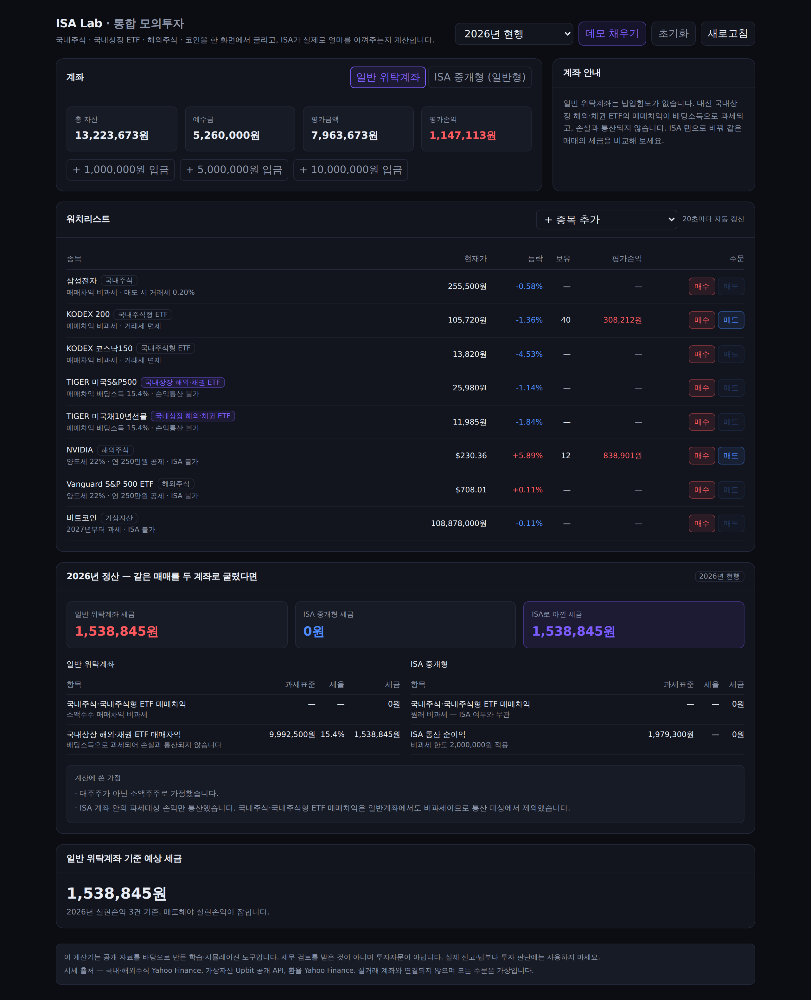
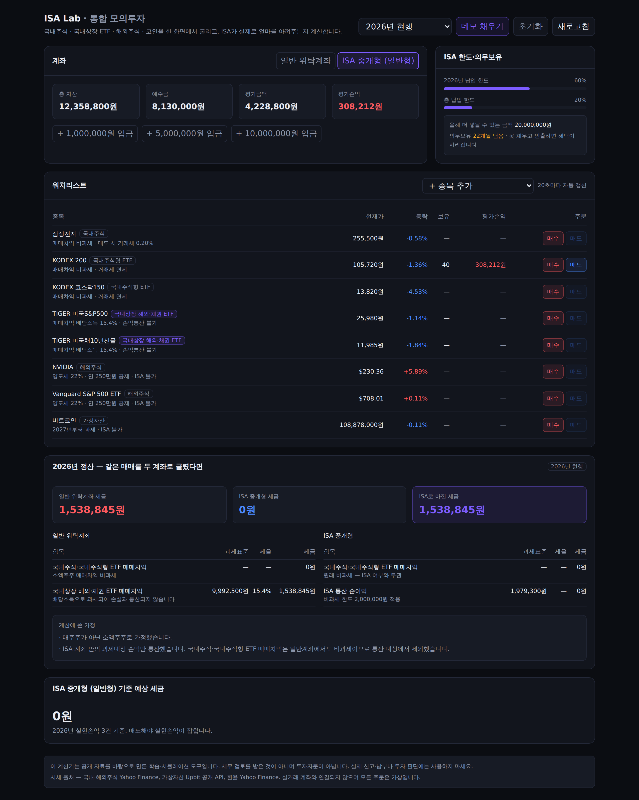

# ISA Lab

**국내주식 · 국내상장 ETF · 해외주식 · 코인을 한 화면에서 굴리고, ISA 계좌가 실제로 얼마를 아껴주는지 계산하는 모의투자 시뮬레이터.**

   

실거래 계좌와 연결되지 않습니다. 주문은 전부 가상이고, 시세만 실제 데이터를 씁니다.
**API 키가 하나도 필요 없습니다** — 클론해서 `npm run dev` 하면 바로 돕니다.



---

## 왜 만들었나

ISA 계좌가 좋다는 말은 어디에나 있는데, **내 매매 기준으로 얼마가 남는지**를 보여주는 곳이 없었습니다.
직접 계산해 보니 이유가 있었습니다. 정확히 계산하려면 다음을 전부 구분해야 합니다.

| 자산 | 매매차익 과세 | 손익통산 | ISA 편입 |
|---|---|---|---|
| 국내 상장 주식 | 비과세 (소액주주) | — | ✅ |
| 국내상장 **국내주식형** ETF | 비과세 | — | ✅ |
| 국내상장 **해외·채권** ETF | **배당소득 15.4%** | ❌ **불가** | ✅ |
| 해외 상장 주식·ETF | 양도소득 22% (연 250만원 공제) | ✅ | ❌ |
| 가상자산 | 2027년부터 22% | ✅ | ❌ |

핵심은 3행입니다. **국내상장 해외ETF의 매매차익은 배당소득이라 손실과 통산되지 않습니다.**
1,000만원 벌고 800만원 잃어도 일반계좌에서는 1,000만원 전액에 15.4%가 붙습니다.
ISA 안에서는 통산이 되고, 남은 순이익에서 비과세 한도를 뺀 금액에만 9.9%가 붙습니다.

데모 데이터 기준 — **일반계좌 1,538,845원 vs ISA 0원.**



---

## 기능

- **통합 워치리스트** — 국내주식·ETF·해외주식·코인을 한 테이블에서. 종목마다 과세 방식을 배지로 표시
- **모의 매매** — 평균단가 기준 보유·평가손익, 자산군별 수수료·증권거래세·환전 스프레드 반영
- **ISA 규칙 강제** — 해외주식·코인 주문을 막고 이유를 알려줍니다. 연간·총 납입한도와 의무보유 3년을 추적
- **연간 정산 비교** — 같은 매매를 일반계좌와 ISA로 굴렸을 때의 세금을 나란히. 항목별 과세표준·세율·근거 표시
- **룰셋 전환** — `2026년 현행`과 `ISA 개편안(미확정)`을 바꿔가며 비교
- **데모 채우기** — 한 번 누르면 절세 효과가 드러나는 매매 이력이 채워집니다

---

## 설계에서 신경 쓴 것

### 1. 세율을 코드에 박지 않았다

세법은 바뀝니다. 2026년에도 증권거래세가 오르고 ISA 개편안이 논의 중입니다.
그래서 모든 숫자를 [`src/lib/tax/rules.ts`](src/lib/tax/rules.ts) 한 곳에 모으고, 항목마다 **근거와 확정 여부**를 달았습니다.

```ts
krSellTaxRate: {
  KOSPI: enacted(0.002, "증권거래세 0.05% + 농어촌특별세 0.15% = 0.20% (2026.01.01 인상)"),
},
isa: {
  annualContributionLimit: proposed(40_000_000, "연 4,000만원으로 확대 (발표, 확정 전)"),
}
```

`proposed`로 표시된 항목은 화면에 **미확정 배지**가 붙습니다.
확정 전 수치를 확정인 것처럼 보여주면 계산기 전체를 못 믿게 되기 때문입니다.

### 2. 할 수 있는 범위를 명시했다

이 도구는 세무 검토를 받지 않았습니다. 그래서 숨기는 대신 계산에 쓴 가정을 화면에 그대로 띄웁니다.

- 대주주가 아닌 소액주주로 가정
- ISA 통산 대상에서 국내주식·국내주식형 ETF 매매차익 제외 (일반계좌에서도 비과세이므로)
- 배당·분배금은 v1 미구현

ISA 비교도 **ISA에 담을 수 있는 자산만** 놓고 합니다.
해외주식까지 넣고 "ISA면 이만큼 아꼈다"고 하면 거짓말입니다 — 애초에 살 수 없기 때문입니다.

### 3. 외부 API가 죽어도 화면이 안 죽는다

시세 3종을 [`src/lib/market/http.ts`](src/lib/market/http.ts) 한 계층으로 묶었습니다.

- 타임아웃 + 지수 백오프 재시도 (4xx는 재시도하지 않음)
- 호스트별 최소 호출 간격 강제 — 업비트 공개 API의 레이트리밋 대응
- TTL 캐시 + **stale 폴백** — 새로 못 가져오면 직전 값을 내주고 화면에 `지연` 배지를 붙임
- `Promise.allSettled` 기반 부분 실패 — 한 종목이 실패해도 나머지는 그대로 표시

### 4. 잔고가 음수가 되는 상태를 만들지 않는다

주문은 막을 조건을 **전부 통과한 뒤에만** 체결됩니다 — ISA 편입 제한, 예수금·보유수량, 환율 미수신.
"일단 체결하고 나중에 검사"하면 복구 불가능한 상태가 남습니다.

---

## 데이터 소스

| 대상 | 소스 | 인증 |
|---|---|---|
| 국내주식·ETF | Yahoo Finance chart v8 (`005930.KS`, `069500.KS`) | 불필요 |
| 해외주식 | Yahoo Finance chart v8 (`AAPL`) | 불필요 |
| 가상자산 | Upbit 공개 API (`/v1/ticker`) | 불필요 |
| 원/달러 환율 | Yahoo Finance (`KRW=X`) | 불필요 |

증권사·거래소 계정을 붙이지 않았습니다. 주문 실행 권한이 있는 키를 공개 배포에 넣지 않기 위해서입니다.

---

## 실행

```bash
git clone https://github.com/sangholabs/isa-lab.git
cd isa-lab
npm install
npm run dev   # http://localhost:3000
```

환경변수 없음. 상태는 브라우저 `localStorage`에 저장되며 서버로 전송되지 않습니다.

```bash
npm test          # 세금·주문 엔진 단위 테스트 40개
npm run build     # 프로덕션 빌드
```

---

## 구조

```
src/
  app/
    api/quotes/route.ts     통합 시세 (소스 선택·부분 실패 처리)
    api/rules/route.ts      룰셋 메타데이터
    page.tsx                대시보드
  lib/
    tax/
      rules.ts              세율·한도 룰셋 (버전 + 근거 + 확정 여부)
      engine.ts             거래비용 · 연간 정산 · ISA 비교
      isa.ts                납입한도(이월 포함) · 편입 제한 · 의무보유
    market/
      http.ts               재시도 · 레이트리밋 · TTL 캐시 · stale 폴백
      upbit.ts / yahoo.ts   소스별 어댑터
    portfolio/
      engine.ts             주문 검증 · 체결 · 평균단가 · 실현손익
      store.ts              저장소 어댑터 (현재 구현체: localStorage)
tests/                      40 passing
```

세금·주문 계산은 전부 순수 함수라 UI 없이 테스트됩니다.

---

## 다음에 할 것

- 배당·분배금 반영 (ISA 절세 효과의 나머지 절반)
- 서버 저장소 어댑터 (Supabase Postgres + RLS) — 인터페이스는 이미 분리해 둠
- 국내상장 ETF 자동 분류 (현재는 목록에 수기 지정)
- 금융소득종합과세 합산 시뮬레이션

---

## 면책

공개 자료를 바탕으로 만든 학습·시뮬레이션 도구입니다.
**세무 검토를 받지 않았고 투자자문이 아닙니다.** 실제 신고·납부나 투자 판단에 사용하지 마세요.
세법 해석과 시행 여부는 국세청·기획재정부 공지를 확인하시기 바랍니다.

## 라이선스

MIT
