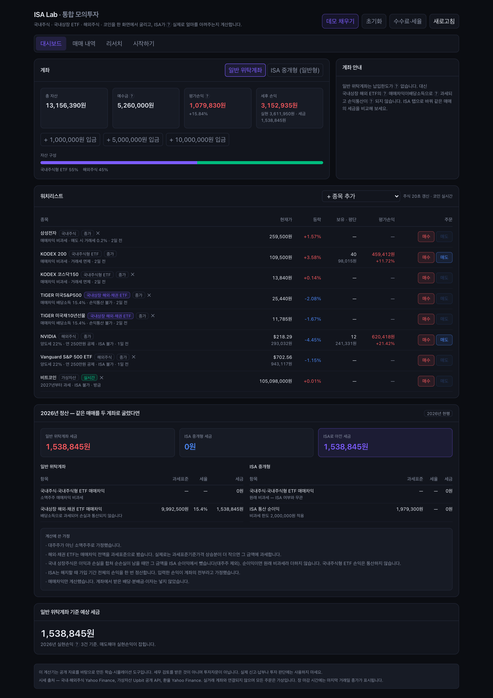
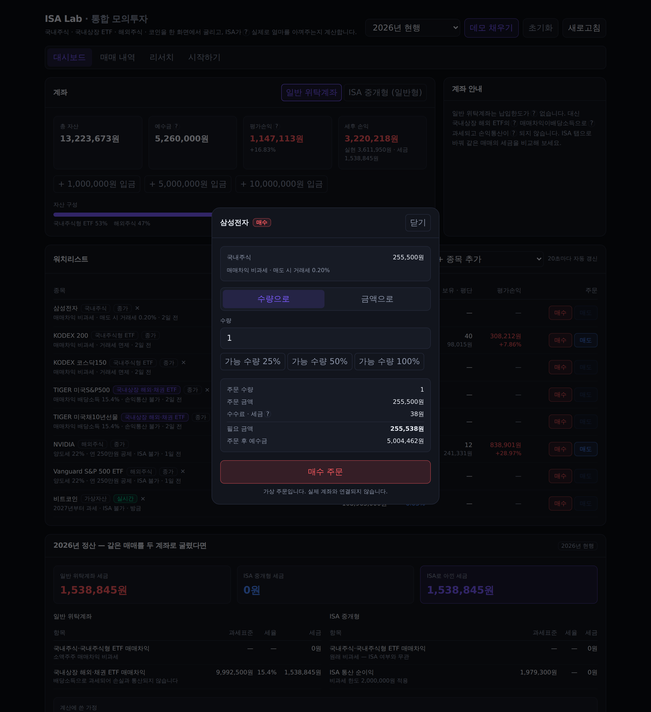
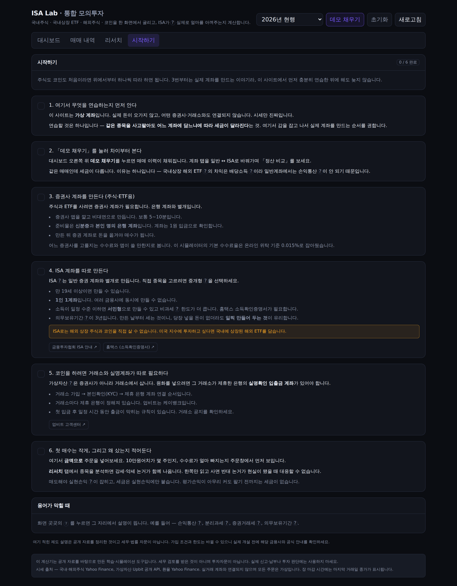

# ISA Lab

**주식도 코인도 처음인 사람이, 계좌를 만들기 전에 먼저 굴려보는 곳.**
국내주식 · 국내상장 ETF · 해외주식 · 코인을 한 화면에서 모의매매하고, ISA 계좌가 실제로 얼마를 아껴주는지 계산합니다.

   

실거래 계좌와 연결되지 않습니다. 주문은 전부 가상이고, 시세만 실제 데이터입니다.
**시세에는 API 키가 하나도 필요 없습니다** — 클론해서 `npm run dev` 하면 바로 돕니다.



---

## 왜 만들었나

ISA가 좋다는 말은 어디에나 있는데, **내 매매 기준으로 얼마가 남는지** 보여주는 곳이 없었습니다.
직접 계산해 보니 이유가 있었습니다. 정확히 계산하려면 다음을 전부 구분해야 합니다.

| 자산 | 매매차익 과세 | 손익통산 | ISA 편입 |
|---|---|---|---|
| 국내 상장 주식 | 비과세 (소액주주) | — | ✅ |
| 국내상장 **국내주식형** ETF | 비과세 | — | ✅ |
| 국내상장 **해외·채권** ETF | **배당소득 15.4%** | ❌ **불가** | ✅ |
| 해외 상장 주식·ETF | 양도소득 22% (연 250만원 공제) | ✅ | ❌ |
| 가상자산 | 2027년부터 22% | ✅ | ❌ |

핵심은 3행입니다. **국내상장 해외ETF의 매매차익은 배당소득이라 손실과 통산되지 않습니다.**
1,000만원 벌고 800만원 잃어도 일반계좌에서는 1,000만원 전액에 15.4%가 붙습니다.
ISA 안에서는 통산이 되고, 남은 순이익에서 비과세 한도를 뺀 금액에만 9.9%가 붙습니다.

데모 데이터 기준 — **일반계좌 1,538,845원 vs ISA 0원.**

---

## 기능

### 모의매매
- **통합 워치리스트** — 국내주식·ETF·해외주식·코인을 한 곳에서. 종목마다 과세 방식을 배지로 표시
- **수량 또는 금액으로 주문** — 「10만원어치」를 넣으면 몇 주인지, 수수료가 얼마 빠지는지 주문 전에 보여줍니다
- **장 상태 구분** — 국내장·미국장·코인을 각각 판정해 `장중` / `종가` / `실시간`을 표시하고, 시세가 몇 분 전 것인지 함께 씁니다
- **코인은 WebSocket 실시간** — 업비트 공개 WebSocket에 브라우저가 직접 붙습니다. 서버를 거치지 않아 체결 즉시 반영됩니다
- **ISA 규칙 강제** — 해외주식·코인 주문을 막고 이유를 알려줍니다. 연간·총 납입한도(이월 포함)와 의무보유 3년을 추적



### 측정
- 평가손익과 수익률, 실현손익 누계, **세후 손익**(평가손익 + 실현손익 − 예상세금)
- 자산군별 비중, 누적 수수료·거래세, 매도 승률
- **금융소득종합과세 2,000만원 경고** — ISA를 쓰는 큰 이유 하나가 여기서 보입니다
- 해외주식 실현이익이 생기면 **다음 해 5월 신고** 안내

### 세금 · 수수료
- 같은 매매를 일반계좌와 ISA로 굴렸을 때의 세금을 나란히. 항목별 과세표준·세율·근거 표시
- `2026년 현행`과 `ISA 개편안(미확정)` 룰셋 전환
- **수수료를 직접 설정** — 증권사 위탁수수료·환전 스프레드·코인 수수료. 프리셋 3종 + 직접 입력
- **세율 출처 화면** — 어느 자료를 언제 확인해 넣었는지 항목별로 열람

### 리서치 (선택)
자기 API 키를 넣으면 Gemini · Claude · GPT · Perplexity가 종목을 분석합니다. 자세한 설계는 아래.

### 처음인 사람을 위해
- **시작하기 탭** — 여기서 연습 → 증권사 계좌 → ISA 계좌 → 코인 거래소 → 첫 매수까지 체크리스트
- **용어 툴팁** — 화면의 `?`를 누르면 그 자리에서 풀립니다. 손익통산, 분리과세, 증권거래세, 의무보유기간 등 30여 개



---

## 설계에서 신경 쓴 것

### 1. 세율을 코드에 박지 않았다

세법은 바뀝니다. 2026년에도 증권거래세가 올랐고 ISA 개편안이 논의 중입니다.
모든 숫자를 [`src/lib/tax/rules.ts`](src/lib/tax/rules.ts) 한 곳에 모으고, 항목마다 **근거와 확정 여부**를 달았습니다.

```ts
krSellTaxRate: {
  KOSPI: enacted(0.002, "증권거래세 0.05% + 농어촌특별세 0.15% = 0.20% (2026.01.01 인상)"),
},
isa: {
  annualContributionLimit: proposed(40_000_000, "연 4,000만원으로 확대 (발표, 확정 전)"),
}
```

`proposed` 항목은 화면에 **미확정 배지**가 붙습니다. 확정 전 수치를 확정처럼 보여주면 계산기 전체를 못 믿게 됩니다.

### 2. 할 수 있는 범위를 명시했다

세무 검토를 받지 않았습니다. 그래서 숨기는 대신 계산에 쓴 가정을 화면에 띄웁니다 — 소액주주 가정, ISA 통산 대상에서 국내주식 매매차익 제외, 배당·분배금 미구현.

ISA 비교도 **ISA에 담을 수 있는 자산만** 놓고 합니다. 해외주식까지 넣고 "ISA면 이만큼 아꼈다"고 하면 거짓말입니다 — 애초에 살 수 없기 때문입니다.

### 3. 외부 API가 죽어도 화면이 안 죽는다

시세 3종을 [`src/lib/market/http.ts`](src/lib/market/http.ts) 한 계층으로 묶었습니다.

- 타임아웃 + 지수 백오프 재시도 (4xx는 재시도하지 않음)
- 호스트별 최소 호출 간격 강제 — 업비트 공개 API의 레이트리밋 대응
- TTL 캐시 + **stale 폴백** — 새로 못 가져오면 직전 값을 주고 `지연` 배지를 붙임
- `Promise.allSettled` 기반 부분 실패 — 한 종목이 실패해도 나머지는 그대로. 보유 종목 시세가 빠지면 합계 옆에 몇 개가 빠졌는지 씁니다

### 4. 잔고가 음수가 되는 상태를 만들지 않는다

주문은 막을 조건을 **전부 통과한 뒤에만** 체결됩니다 — ISA 편입 제한, 예수금·보유수량, 환율 미수신.
"일단 체결하고 나중에 검사"하면 복구 불가능한 상태가 남습니다.

### 5. LLM은 계산에 쓰지 않는다

세금·손익은 전부 순수 함수입니다. 같은 입력에 같은 답이 나와야 하고, 테스트로 못 박을 수 있어야 하며, 틀렸을 때 어느 줄이 틀렸는지 짚을 수 있어야 하기 때문입니다.
LLM은 **판단 재료를 모으는 쪽**에만 씁니다.

---

## 리서치 기능 설계

### 키를 서버에 저장하지 않는다

```
브라우저(localStorage) ──키──▶ /api/research ──▶ LLM API
                                  저장 X · 로깅 X
```

브라우저에서 LLM API를 직접 못 부르기 때문에(CORS) 서버를 거칩니다. 키는 요청 안에서만 살아 있고, 에러 메시지를 그대로 노출하므로 키 패턴은 [redact](src/lib/research/providers.ts) 처리합니다.

### 매수·매도를 지시하지 않는다

프롬프트에 못을 박았습니다 — **강세 논거와 약세 논거를 같은 비중으로**, 근거와 함께, 확인하지 못한 것은 `unknowns`에 솔직히. 목표가를 쓰려면 어떤 가정 아래인지 함께 쓰게 합니다.

출력은 이렇게 나옵니다.

| 항목 | 내용 |
|---|---|
| 강세 논거 · 약세 논거 | 나란히, 각각 근거 첨부 |
| 조건부 시나리오 | 「X가 일어나면 → Y를 의미」 |
| 지켜볼 것 | 앞으로 확인할 지표·일정 |
| 확인하지 못한 것 | 모델이 검증 못 한 부분 |
| 근거 확실성 | 0–100 (상승 확률이 아님) |

여러 모델을 켜면 **갈린 지점을 위에 따로 모읍니다.** 억지로 하나로 합치지 않습니다 — 의견이 갈린다는 건 그 부분이 아직 확정적이지 않다는 뜻이고, 그걸 감추면 사용자가 걸러낼 방법이 없어집니다.

### 모델 목록을 코드에 박지 않는다

제공사가 모델 이름을 자주 바꿉니다. 목록을 하드코딩하면 반드시 낡습니다.
그래서 **「모델 목록」 버튼이 사용자 키로 제공사에 직접 물어봅니다** — OpenAI `/v1/models`, Anthropic `/v1/models`, Gemini `/v1beta/models`. Perplexity만 목록 API가 없어 코드에 든 후보를 씁니다.

가격도 적지 않습니다. 요금은 수시로 바뀌므로 **공식 요금표 링크**만 걸고, 어느 쪽이 싼지에 대한 힌트(`mini`·`flash`·`haiku`가 저렴)만 붙였습니다.

---

## 데이터 소스

| 대상 | 소스 | 인증 | 실시간성 |
|---|---|---|---|
| 가상자산 | Upbit **WebSocket** (`wss://api.upbit.com/websocket/v1`) | 불필요 | **실시간 체결가** |
| 가상자산 (폴백) | Upbit REST (`/v1/ticker`) | 불필요 | 20초 |
| 국내주식·ETF | Yahoo Finance chart v8 (`005930.KS`) | 불필요 | 지연 · 장 마감 시 종가 |
| 해외주식 | Yahoo Finance chart v8 (`AAPL`) | 불필요 | 지연 · 장 마감 시 종가 |
| 원/달러 환율 | Yahoo Finance (`KRW=X`) | 불필요 | 60초 |
| 리서치 (선택) | OpenAI · Anthropic · Google · Perplexity | 사용자 키 | — |

### 국내주식 실시간을 넣지 않은 이유

무료로 열려 있지 않습니다. 조사 결과를 그대로 적습니다.

| 경로 | 상태 |
|---|---|
| KRX OPEN API | **일별(EOD) 전용.** 실시간 없음. 약관상 *"비상업적 목적으로만"*, *"제3자에게 제공할 수 없다"* → 공개 서비스에 부적합 |
| `data.krx.co.kr` 스크래핑 | **2025-12-27부터 로그인 필수로 차단.** `getJsonData.cmd`가 `LOGOUT`/400 반환. pykrx도 이 문제로 깨짐 |
| 네이버·다음 금융 비공식 엔드포인트 | `robots.txt`가 `Disallow: /`. 다음은 403 능동 차단. **2026-02 특허법원 네이버 승소**(DB제작자 권리, 배상 8천만원)로 "공개돼 있으니 써도 된다"는 논리가 부정됨 |
| Twelve Data 등 해외 벤더 | XKRX는 EOD 지연 + 유료 플랜 필수 |
| 한국투자증권 KIS Open API | 실시간 WebSocket 있음. **개인 앱키 필요** — 아래 참조 |

가상자산만 실시간인 이유는 업비트가 인증 없이 WebSocket을 열어주기 때문입니다. 국내·해외 주식은 그런 소스가 없어서, **지연 시세임을 화면에 표시**하는 쪽을 택했습니다.

### 수수료·세율을 API로 못 가져오는 이유

| 항목 | 조사 결과 |
|---|---|
| 증권사 위탁수수료 | 공공데이터포털에 「금융투자회사 주식거래 수수료」 API가 있으나, 실제 요율은 이벤트·등급·개설 경로마다 달라 **공시값을 강제하면 오히려 틀립니다.** → 프리셋 + 사용자 입력 |
| 업비트 수수료 | `/v1/orders/chance`는 **인증 필수**(401 확인). 수수료 하나 때문에 실거래 키를 받는 건 리스크 대비 이득이 없습니다 → 상수 + 사용자 입력 |
| 세율 | **기계가 읽을 수 있는 세율 API는 없습니다.** 국가법령정보 OPEN API는 법령 *본문*만 주고, 별표·부칙·특례가 얽혀 자동 파싱은 조용히 틀립니다 → 사람이 확인해 적고 **확인일과 출처를 화면에 노출** |
| ETF 과세유형(국내주식형/기타) | 이 구분을 주는 공식 필드를 **찾지 못했습니다.** 기초지수명으로 추정하면 오분류 위험이 있어, 목록에 **직접 지정**해 두고 화면에 표시합니다 |

---

## 실행

```bash
git clone https://github.com/sangholabs/isa-lab.git
cd isa-lab
npm install
npm run dev   # http://localhost:3000
```

환경변수 없음. 포트폴리오와 API 키는 브라우저 `localStorage`에만 저장되고 서버로 가지 않습니다.

```bash
npm test          # 세금·주문·성과·장상태·실시간 파싱 테스트 49개
npm run build     # 프로덕션 빌드
```

---

## 구조

```
src/
  app/
    api/quotes/route.ts     통합 시세 (소스 선택 · 부분 실패 처리)
    api/research/route.ts   LLM 프록시 (키 미저장)
    api/models/route.ts     제공사별 모델 목록 조회
    api/rules/route.ts      룰셋 메타데이터
    page.tsx                대시보드 · 탭
  lib/
    tax/
      rules.ts              세율·한도 룰셋 (버전 + 근거 + 확정 여부)
      engine.ts             거래비용 · 연간 정산 · ISA 비교
      isa.ts                납입한도(이월) · 편입 제한 · 의무보유
    market/
      http.ts               재시도 · 레이트리밋 · TTL 캐시 · stale 폴백
      marketState.ts        국내장/미국장/코인 개장 판정
      useUpbitStream.ts     업비트 WebSocket 실시간 (재연결 · 4Hz 스로틀)
      upbit.ts / yahoo.ts   소스별 어댑터
    portfolio/
      engine.ts             주문 검증 · 체결 · 평균단가 · 실현손익
      metrics.ts            수익률 · 세후 손익 · 자산 비중 · 종합과세 경고
      store.ts              저장소 어댑터 (현재 구현체: localStorage)
    research/
      prompt.ts             리서치 프롬프트 · 모델 간 이견 추출
      providers.ts          4개 제공사 어댑터 · JSON 파싱 · 키 redact
    glossary.ts             용어 사전 (툴팁)
  components/               UI
tests/                      49 passing
```

세금·주문·성과 계산은 전부 순수 함수라 UI 없이 테스트됩니다.

---

## 실거래 연동을 넣지 않은 이유

한국투자증권 KIS API와 업비트 API로 **실제 주문을 넣는 것은 기술적으로 가능합니다.** 그런데 이 프로젝트에는 넣지 않았습니다. 아키텍처가 맞지 않기 때문입니다.

- **공개 배포된 웹앱**입니다. 실거래 키는 돈을 움직이는 자격증명인데, 브라우저 `localStorage`에 두면 XSS 한 번에 자산이 위험합니다. 서버에 두면 그 서버가 거래 권한을 갖게 됩니다.
- **업비트 API는 IP 화이트리스트**가 전제인데 Vercel 서버리스는 출구 IP가 고정되지 않습니다.
- KIS 실계좌 주문은 별도 신청·심사가 필요하고, 실수 한 번의 비용이 시뮬레이터와 차원이 다릅니다.

대신 안전한 경로가 있습니다.

| 방식 | 무엇이 되나 | 위험 |
|---|---|---|
| **KIS 모의투자 서버 연동** (`svr=vps`) | 실제 API로 주문·체결·잔고 흐름을 그대로 연습 | 가상 계좌라 돈이 움직이지 않음 |
| **조회 전용 키 연동** | 실제 보유·체결내역을 읽어와 이 시뮬레이터의 성과와 비교 | 주문 권한 없는 키만 사용 |
| 실주문 | — | **공개 웹앱이 아니라 로컬 전용 앱으로 분리해야 함** |

## 알려진 한계

- **배당·분배금 미구현** — ISA 절세 효과의 나머지 절반입니다
- **거래소 휴장일 미반영** — 장 상태는 요일과 시간만 봅니다. 공휴일에는 `장중`으로 표시될 수 있어, 시세 시각을 함께 띄웁니다
- **지정가 주문 없음** — 현재가로만 체결됩니다
- **국내상장 ETF 분류는 수기** — 공식 분류 필드를 찾지 못해 목록에 직접 지정했습니다
- **거래소 휴장일 미반영** — 장 상태는 요일·시간만 봅니다
- **실거래 주문 없음** — 위 참조

## 면책

공개 자료를 바탕으로 만든 학습·시뮬레이션 도구입니다.
**세무 검토를 받지 않았고 투자자문이 아닙니다.** 실제 신고·납부나 투자 판단에 사용하지 마세요.
리서치 탭의 LLM 출력은 사실 확인이 되지 않은 내용이 섞일 수 있습니다.
세법 해석과 시행 여부는 국세청·기획재정부 공지를, 계좌 개설 조건은 해당 금융사 안내를 확인하시기 바랍니다.

## 라이선스

MIT
