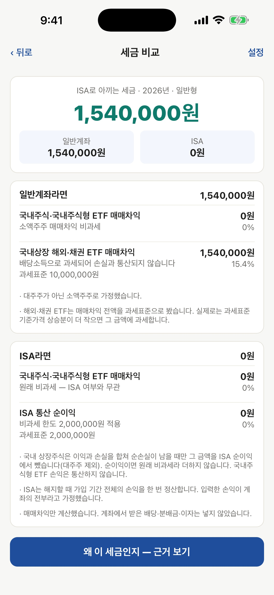
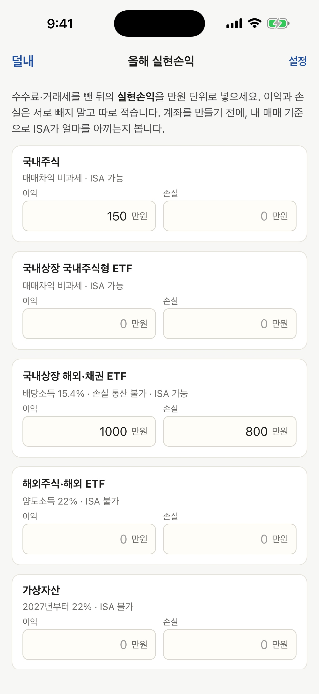
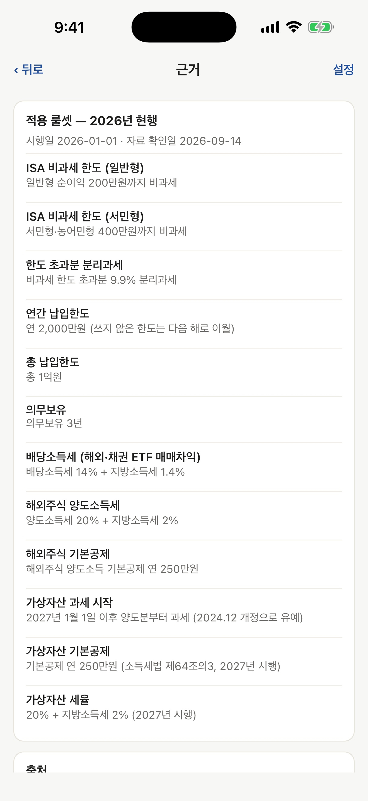
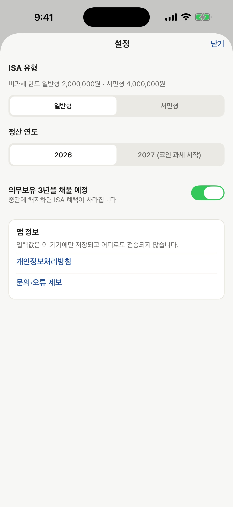

# 덜내 — ISA 절세 계산기 (iOS · Android)

**올해 실현손익을 자산군별로 넣으면, 같은 매매를 일반계좌와 ISA로 했을 때의 세금 차이를 계산합니다.**
웹 [ISA Lab](../../README.md)의 「세금 비교」를 떼어낸 앱입니다. 웹과 **같은 세금 엔진**을 폰 안에서 돌리고, 서버·로그인·네트워크가 없습니다.

  

<p>
  
  
  
  
</p>

---

## 왜 앱인가

ISA가 세금을 아껴 준다는 말은 흔한데, **내 매매 기준으로 얼마인지**는 직접 세야 합니다. 그런데 손으로 세기 어렵습니다.

| 자산군 | 일반계좌 | ISA |
|---|---|---|
| 국내주식 · 국내주식형 ETF | 매매차익 비과세 | 비과세 · 국내주식 순손실은 ISA 순이익에서 차감 |
| 국내상장 해외·채권 ETF | 배당소득 15.4%, **손실과 통산 안 됨** | 계좌 안에서 통산 · 비과세 한도 뒤 9.9% |
| 해외주식 · 해외 ETF | 양도소득 22% (연 250만원 공제) | 담을 수 없음 |
| 가상자산 | 과세 시작 연도부터 22% | 담을 수 없음 |

해외·채권 ETF에서 1,000만원을 벌고 800만원을 잃었다면, 일반계좌는 1,000만원 전액에 세금이 붙어 **1,540,000원**, ISA는 **0원**입니다. 덜내는 이 계산을 자산군 5개 입력으로 끝냅니다.

## 화면

| 입력 | 결과 | 근거 | 설정 |
|---|---|---|---|
| 자산군 5개 × 이익/손실, 만원 단위 | 절세액 · 일반계좌 vs ISA · 항목별 과세표준·세율·세금·가정 · ISA에 못 담는 자산은 따로 | 적용한 세율·한도마다 확정 여부와 설명 · 출처 링크 · 자료 확인일 · 고지 | ISA 유형 · 정산 연도 · 의무보유 · 개인정보처리방침 |

입력과 설정은 기기에만 저장되고, 앱을 다시 열면 그대로 돌아옵니다. 「예시로 보기」를 누르면 입력을 채운 뒤 결과 화면으로 바로 갑니다.

---

## 설계에서 신경 쓴 것

### 1. 웹과 같은 세금 엔진, 앱에는 세율이 한 줄도 없다
세금 계산은 전부 [`packages/tax-engine`](../../packages/tax-engine)이 합니다. npm workspaces로 웹(Next.js)과 앱(Expo)이 같은 소스를 import하고, 테스트 하나가 둘을 함께 지킵니다 ([ADR-0001](../../docs/adr/0001-mobile-app-react-native-expo.md), [ADR-0002](../../docs/adr/0002-npm-workspaces-shared-engine.md)).
입력 힌트의 「15.4%」 같은 문구도 룰셋에서 읽습니다. 세법이 바뀌면 [`rules.ts`](../../packages/tax-engine/src/rules.ts) 한 곳만 고칩니다.

### 2. 이익과 손실을 합치지 않는다
처음 골격은 자산군마다 `이익 − 손실`을 한 줄로 엔진에 넘겼습니다. 그러면 해외·채권 ETF의 손실이 일반계좌에서도 통산돼, 예시 절세액이 1,540,000원이 아니라 308,000원으로 나왔습니다.
지금은 이익과 손실을 두 행으로 넘기고, 통산할지는 엔진이 정합니다 ([ADR-0004](../../docs/adr/0004-mobile-input-gain-loss-rows.md)). 이 경로는 [`tests/mobile.test.ts`](../../tests/mobile.test.ts)가 지킵니다.

### 3. 서버·로그인·네트워크가 없다
입력이 숫자 10개뿐이라 서버가 할 일이 없습니다. 오프라인에서도 바로 답이 나오고, 스토어 개인정보 항목은 「수집 없음」입니다 ([ADR-0003](../../docs/adr/0003-mobile-v1-no-server.md), [개인정보처리방침](https://isa-lab.vercel.app/privacy)).
저장본이 깨졌거나 형식이 달라도 앱은 기본값으로 열립니다. 저장소 읽기에 실패한 실행에서는 저장하지 않아 기존 입력을 빈 값으로 덮지 않습니다.

### 4. 필요한 만큼만
화면이 셋이라 라우터 없이 상태 하나로 전환하고, UI·상태관리 라이브러리를 쓰지 않습니다. 의존성은 Expo 기본과 AsyncStorage, safe-area뿐입니다.
Android 뒤로가기는 헤더의 「‹ 뒤로」와 같은 규칙을 따릅니다. 화면 낭독기는 입력칸마다 「국내주식 이익, 만원」처럼 자산군과 칸 이름을 읽습니다.

### 5. 아이콘도 코드로
[`assets/make-icons.swift`](assets/make-icons.swift)가 앱 아이콘·Android 적응형 아이콘·스플래시·Play 스토어 그래픽을 그립니다. 높은 반투명 막대는 일반계좌 세금, 낮은 초록 막대와 아래 화살표는 ISA로 줄어든 세금입니다.

```bash
swift apps/mobile/assets/make-icons.swift
```

---

## 실행

저장소 루트에서 실행합니다. npm workspaces라 설치는 루트에서 한 번이면 됩니다. 줄 끝에 주석을 붙이지 마세요. zsh는 `#` 뒤를 인자로 넘깁니다.

```bash
npm install
npm test
npm run mobile
```

`npm run mobile` 뒤 터미널의 QR을 폰 **Expo Go**로 찍습니다. 폰과 맥이 같은 Wi-Fi여야 합니다. iOS 시뮬레이터는 `i`, Android 에뮬레이터는 `a`입니다.

로컬 릴리스 빌드(`npx expo prebuild` 뒤 Xcode·Gradle)를 할 때는 두 가지를 조심하세요. Android는 JDK 17로 빌드합니다. Android Studio에 들어 있는 JDK 25로는 CMake 설정 단계에서 실패합니다. 그리고 prebuild가 `package.json`의 `ios`·`android` 스크립트를 `expo run:*`으로 바꾸니 커밋 전에 되돌립니다. `ios/`·`android/`는 prebuild가 만드는 폴더라 저장소에 넣지 않습니다.

## 구조

```
apps/mobile/
├── App.tsx            화면 3개 + 설정 시트. 라우터 없음
├── src/state.ts       입력 상태 · 예시 · 저장본 복원
├── src/compute.ts     입력 → 엔진 호출 (이익·손실 두 행)
├── src/format.ts      원 · 만원 · % 표기
├── assets/            아이콘·스플래시 (make-icons.swift가 생성)
└── app.json           이름 · 식별자 · 네이티브 설정
```

## 출시 준비

| 항목 | 상태 |
|---|---|
| PRD v0.1 기능 | 완료 |
| 아이콘 · 스플래시 · 스토어 그래픽 | 완료 |
| 개인정보처리방침 · 문의 링크 | 완료 (웹 배포는 main 병합 후) |
| 스토어 등록 문구 | [초안](../../docs/store/listing.md) |
| Apple · Google 개발자 계정, EAS 빌드 | 대기 |
| Android 확인 (뒤로가기 · 키보드 · 적응형 아이콘) | 에뮬레이터 완료 (Android 16, 릴리스 APK) · 실기기 대기 |

## 알려진 한계
- 매매차익만 계산합니다. 배당·이자, 대주주 양도세, 금융소득종합과세는 반영하지 않습니다.
- ISA는 법상 해지할 때 가입 기간 전체를 한 번 정산합니다. 여기서는 입력한 손익이 계좌의 전부라고 가정합니다.
- 세법이 바뀌면 룰셋을 고친 새 버전을 스토어 심사를 거쳐 내야 합니다. 앱이 네트워크를 쓰지 않아 원격 업데이트를 넣지 않았습니다.
- 모노레포라 React가 두 벌 설치됩니다. 웹은 19.2.8, 앱은 Expo SDK 57이 요구하는 19.2.3입니다. Expo가 앱 번들에는 한 벌만 넣어 동작에는 문제가 없지만, `expo-doctor`는 중복으로 경고합니다.
- 세무 검토를 받은 계산이 아닙니다. 실제 신고·납부는 국세청·증권사 기준을 따르세요.
